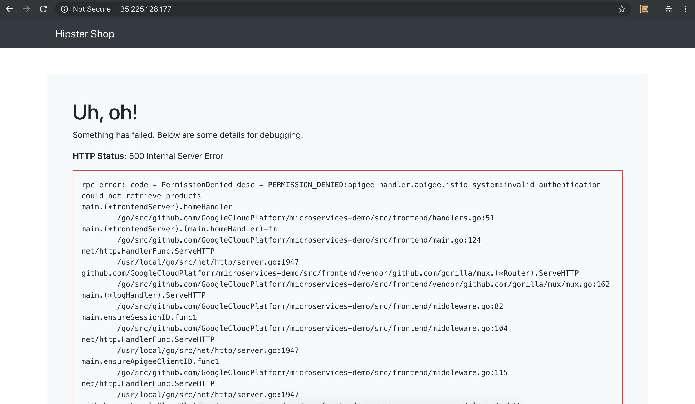
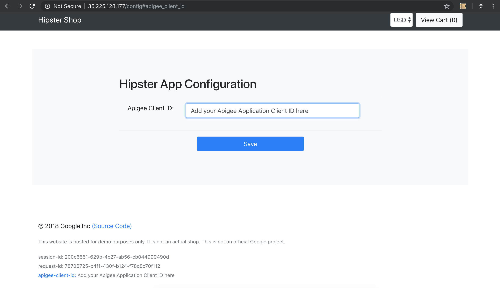

# Hipster API Demo

## Install 

#### Tool Prerequisites

`gcloud`
`kubectl` 
`apigee-istio`

#### Information Prerequisite
Set your Google Cloud Project ID

```
export PROJECT_ID=<gcp-project-id>
export ZONE=us-central1-a	
```

Let's go

```
export CLUSTER_NAME=hipster-demo1

gcloud config set project ${PROJECT_ID}

gcloud container clusters create ${CLUSTER_NAME} \
    --machine-type=n1-standard-2 \
    --num-nodes 3 \
    --enable-autoscaling --min-nodes 1 --max-nodes 10 \
    --cluster-version=1.11.4 \
    --zone=${ZONE} \
    --no-enable-legacy-authorization

gcloud container clusters get-credentials ${CLUSTER_NAME} --zone=${ZONE}

gcloud compute disks create --size=1GB --zone=${ZONE} istio-disk

kubectl apply -f setup-persistent-disk.yaml

watch kubectl get job setup-persistent-disk
#wait for the job to complete

kubectl delete -f setup-persistent-disk.yaml

kubectl create clusterrolebinding cluster-admin-binding \
  --clusterrole=cluster-admin \
  --user="$(gcloud config get-value core/account)"

kubectl apply -f istio-install/istio-demo.yaml

#update the sidecar injector
kubectl apply -f istio-install/istio-sidecar-injector.yaml

kubectl label namespace default istio-injection=enabled

kubectl apply -f istio-manifests

kubectl apply -f deploy-manifests

kubectl apply -f filter.yaml

```

### Test

```
export GATEWAY_URL=http://$(kubectl -n istio-system get service istio-ingressgateway -o jsonpath='{.status.loadBalancer.ingress[0].ip}')

#Get List of Products
curl $GATEWAY_URL/products

#Get Ads
curl $GATEWAY_URL/ads

#Get Recommendations
curl $GATEWAY_URL/recommendations/1

#Get Currencies
curl $GATEWAY_URL/currencies

```
Explore the API endpoints in folder `endpoints/demo.http.swagger.json`

### Apigee Demo

```
apigee-istio provision -o [organization] -e [environment] -u [username] -p [password] > istio-install/handler.yaml

kubectl apply -f istio-install/definitions.yaml
kubectl apply -f istio-install/handler.yaml

kubectl apply -f demo/rule.yaml

#Get List of Products
curl $GATEWAY_URL/products

#The above will fail with HTTP 403
```

#### Hipster App client Apigee Demo

```
# Disable the Apigee Mixer plugin rule if enabled earlier
kubectl delete -f demo/rule.yaml

# Export FRONTEND_URL to navigate to Hipster App
export FRONTEND_URL=http://$(kubectl get service frontend-external -o jsonpath='{.status.loadBalancer.ingress[0].ip}')
```

* Launch the FRONTEND_URL in a modern browser (Chrome/Safari/Firefox) and navigate around the Hipster Shop. For OSX `open $FRONTEND_URL` 
  * _This will succeed without any errors_


```
#Re-apply the Apigee Mixer plugin rule to enforce authorization
kubectl apply -f demo/rule.yaml
```
* Navigate around the Hipster Shop again in your browser. 
  * _This will partially fail with HTTP 500 and HTTP 403 errors_



* Generate a Developer and an API Product with the appropriate service names [example](https://docs.apigee.com/api-platform/istio-adapter/installation#get_an_api_key). You will need to add at least the following to the API Product Istio Services:
```
productcatalogservice.default.svc.cluster.local
recommendationservice.default.svc.cluster.local
currencyservice.default.svc.cluster.local
cartservice.default.svc.cluster.local
```

* Create an Apigee application with the above API Product either in the Management UI or an Apigee developer portal [example](https://docs.apigee.com/api-platform/istio-adapter/installation#4_create_a_developer_app)

* Copy the Apigee application Client ID above, add the Client ID to the Hipster App configuration, and click the **Save** button. `$FRONTEND_URL/config`



* Navigate around the Hipster Shop again in your browser!
  * _This will succeed without any errors for the services you added to the API Product_


